### 页面布局没，三栏布局，左右宽度300px，中间自适应

  1. 快捷键 section.layout.float
    ```
      <section class="layout float"></section>
    ```
  2. 快捷键 div.left+div.center+div.left
    ```
      <div class="left"></div>
      <div class="right"></div>
      <div class="center"></div>
    ```
  3. 五种方法 （3-3）
    ```
      浮动解决方法
      绝对定位解决方法
      flexbox解决方法
      表格解决方法
      网格解决方法
    ```

  4. 优缺点
    ```
      浮动兼容性比较好
      绝对方便，但是都是脱离文档流
      flex手机
      表格布局兼容性很好，当其中一个单元格高度超出时候，其他也需要超出
    ```
  5. 高度增加，则flexbox解决方法，表格解决方法，会随着内容撑开。但是浮动，则会在超出高度部分，溢出.则需要bfc模式解决
  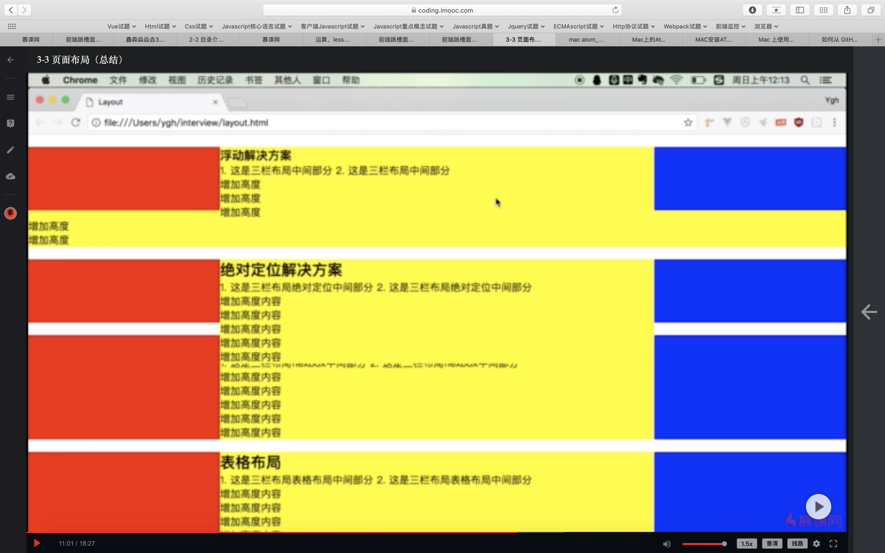

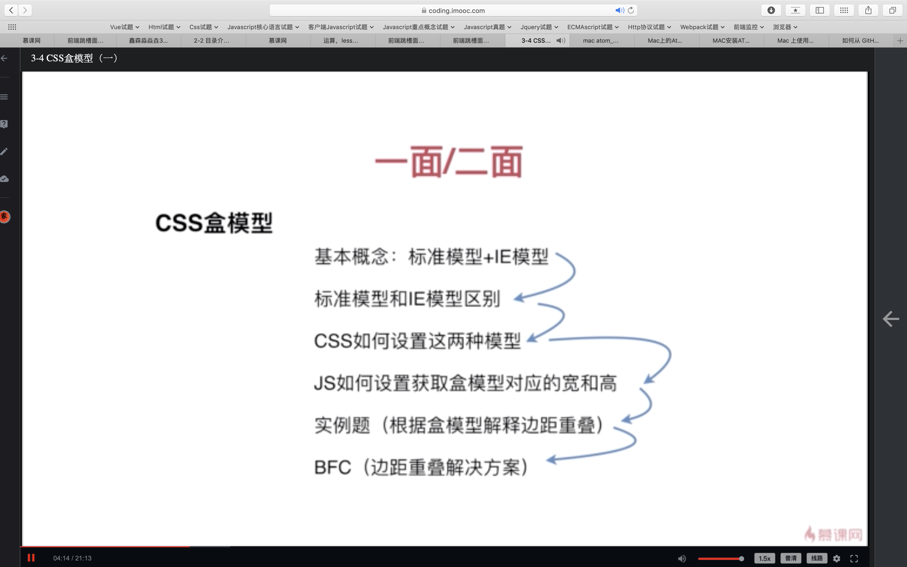
  1. box-sizing:border-box;box-sizing:content-box;
  2. js如何获取盒模型对应的宽高
  ```
    dom.style.width/height(内联样式)
    dom.currentStyle.width/height（ie）
    window.getComputedStyle(dom).width/height（chore等）
    dom.getBundingClientRect().width
  ```

### 3.5 css盒模型bfc
- 原因是边距重叠
```
设置父元素，overflow:auto
或者，设置父元素，float:left/right
```
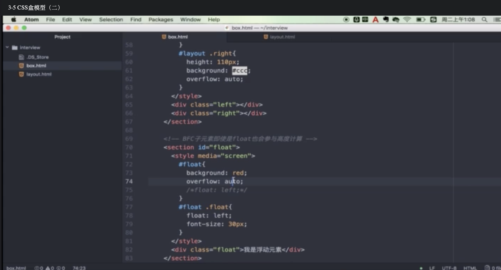

### 3.9 HTTP协议
- http方法
  1.get
  2.post
  3.put 更新资源
  4.delete 删除资源
  5.head 获取报文首部资源

- get 与 post区别
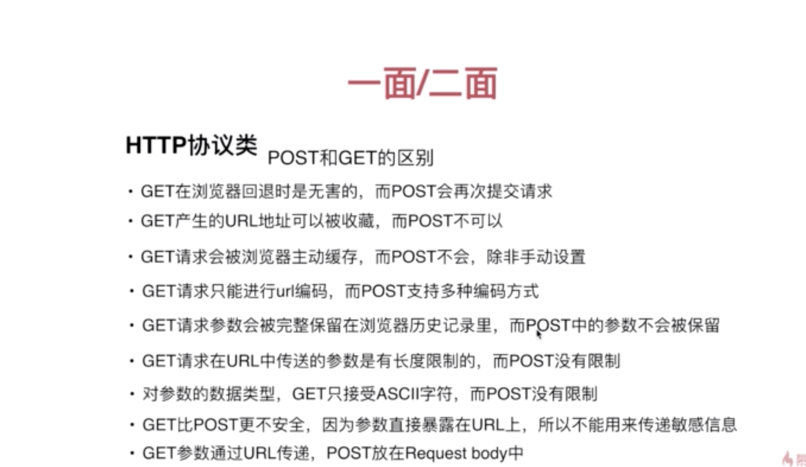

- http状态码
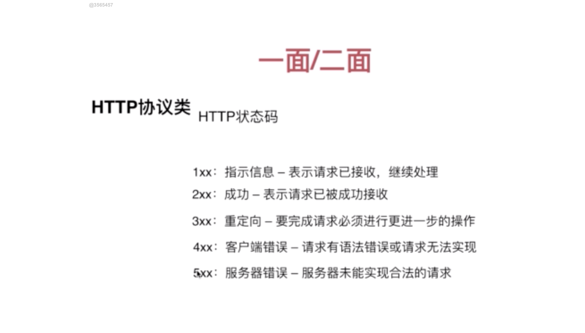

### 3.10 原型链
- 原型链
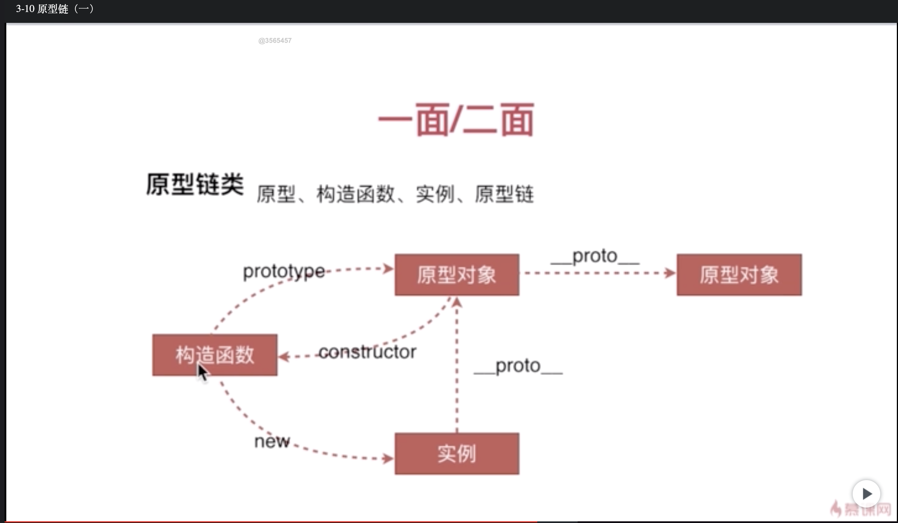
- 两个公式
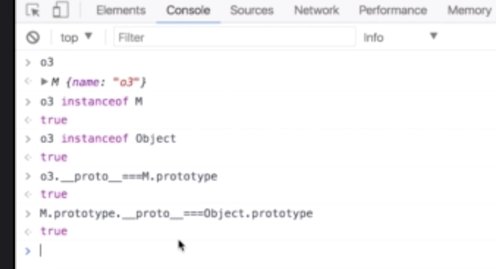
- 三种创建对象方式以及new的原理


### 3.12面向对象
- call继承，无法继承原型链
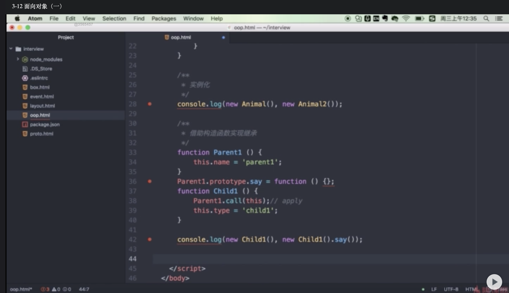
- 原型链继承，缺点改变一个实例另一个也改变
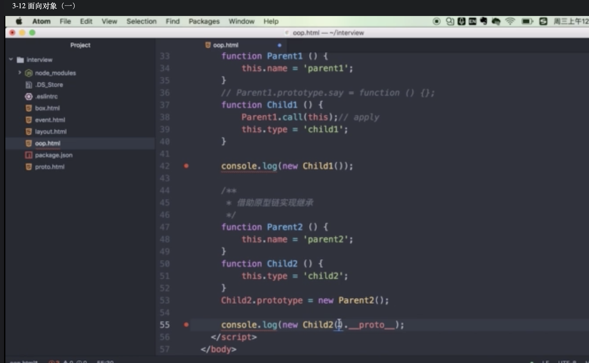
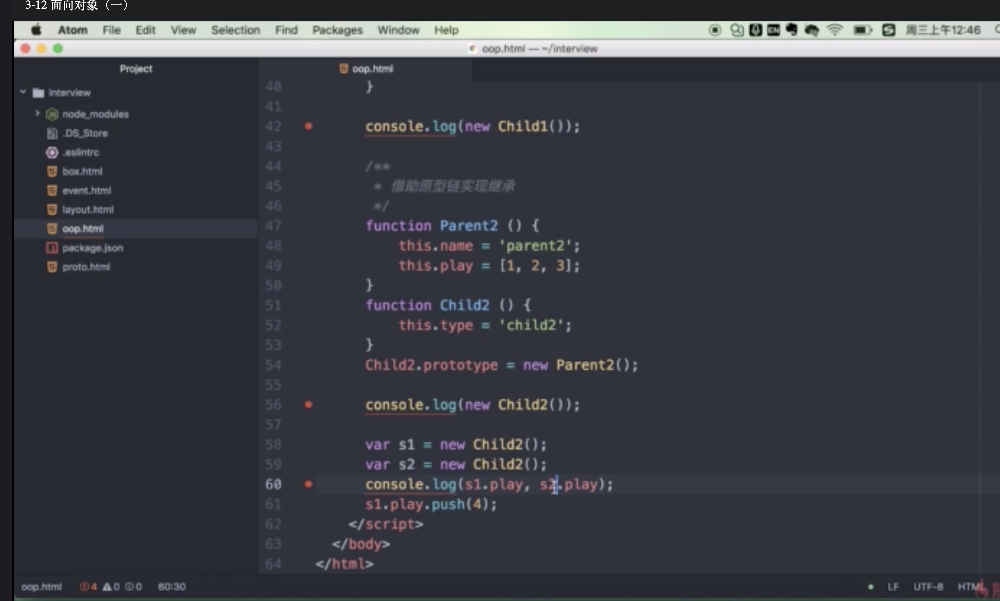
- 组合继承，缺点每次创建实例，原型链也创建
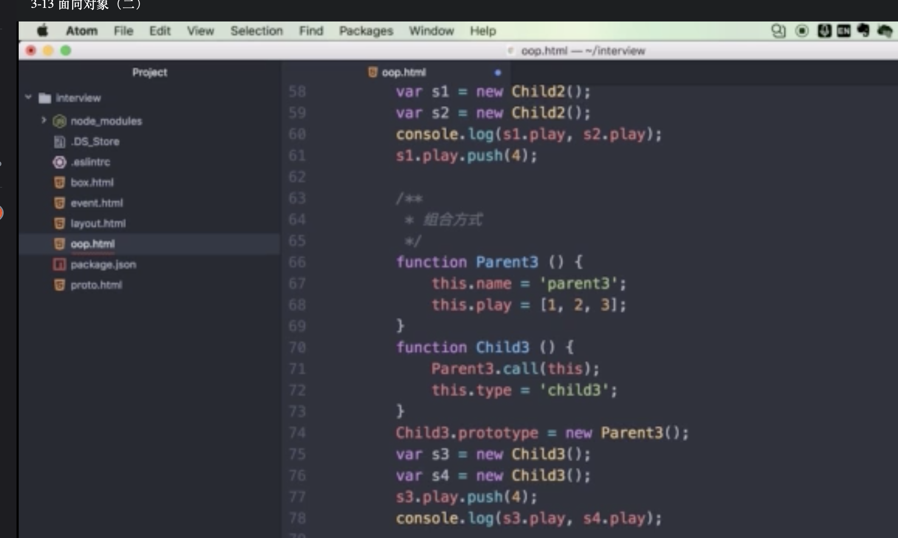
- 组合继承优化
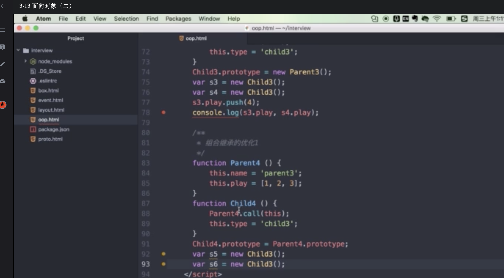

### 3.14通讯类


  

