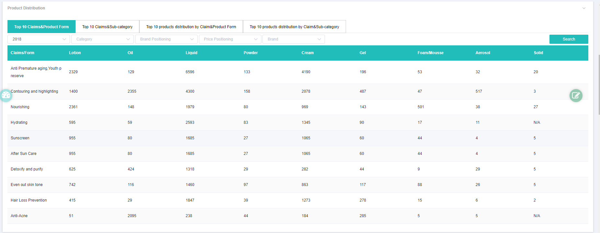
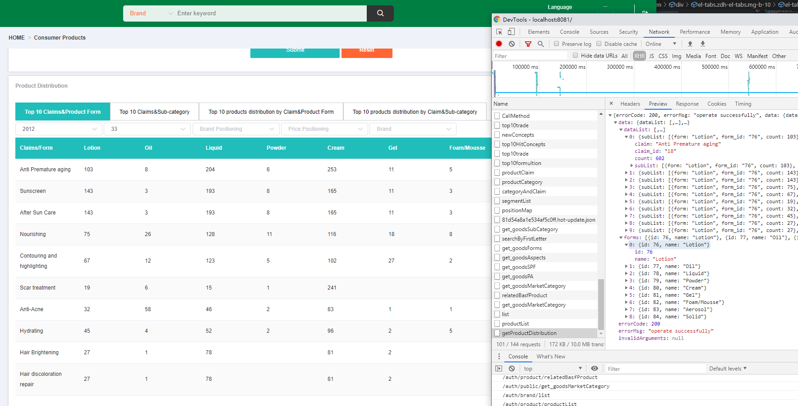

### tab数据结构调整



### 

```
    <my-panel v-loading="loading.brandIndexBriefClaimCtgyParams" class="mg-tb-10">
        <span slot="header" class="data-sourse-style"></span>
        // :data : 为ClaimDetail数组中的title值获取
        <el-table
            class="zdh-el-table-style mg-t-15"
            :data="claimDetail"
            stripe
            style="width: 100%">
            <el-table-column
            prop="title"
            :label="$t('txt.claimsCategory')"
            align="center"
            width="180">
            </el-table-column>
            // 转化的映射关系 id 对 title
            <el-table-column
            :prop="item.id + ''"
            :label="item.name"
            align="center"
            v-for="(item, idx) in categoryClaim.categoryDetail"
            :key="idx"
            >
                // 此处将没有值的数据转化为N/A
                <template slot-scope="scope">
                <span>{{scope.row[item.id] || 'N/A'}}</span>
                </template>
            </el-table-column>
        </el-table>
    </my-panel>
```

```
    claimDetail () {
        return this.categoryClaim.claimDetail.map(v => {
        let res = {}
        v.listData.forEach((v, i) => {
            res[v.metrics] = v.count
        })
        res.title = v.title
        return res
        })
    },
```

### tab数据结构调整


##### 表格

```
    <el-table
        class="zdh-el-table-style"
        // 列表项
        :data="claimsData.list"
        stripe
        style="width: 100%">
        // 纵列表头
        <el-table-column
        v-for="(item, index) in claimsData.header"
        :key="index"
        //prop为表头每一项
        :prop="item.prop"
        :label="item.label">
        </el-table-column>
    </el-table>

    data: (){
        return {
            claimsData: {
                header: [],
                list: []
            }
        }
    }
```

#### 结构
```
 async getDatas () {
    if (this.activeName === 'first') {
    this.topSearchParams.registeredYear = parseInt(this.topSearchParams.registeredYear)
    await this.getTopDistributionListDataApi({...this.topSearchParams, tabType: 'claimForm'})
    this.claimAndProductFormList = this.topDiscriptionListData
    // heard为头部的数组。第一项为Claims/Form，其余为prop 为id 但是显示为form的label
    this.claimsData.header = [
        { prop: 'claims', label: 'Claims/Form' },
        ...this.topDiscriptionListData.forms.map(v => {
        return {
            prop: v.id + '',
            label: v.name
        }
        })
    ]
    // 列表数据 为claim 映射关系为 id : count
    this.claimsData.list = this.topDiscriptionListData.dataList.map(v => {
        let res = { claims: v.claim }
        v.subList.forEach(item => {
        res[item.form_id] = item.count
        })
        return res
    })
}

```
